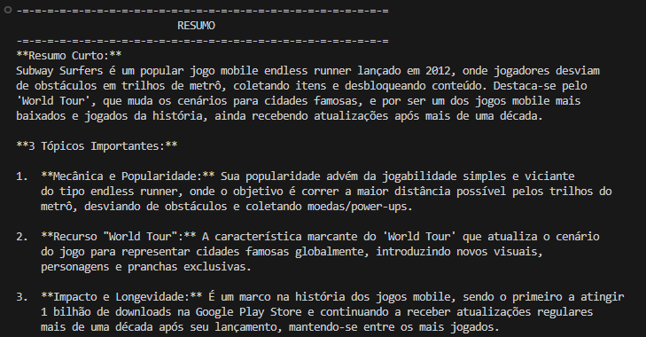
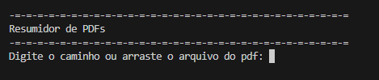
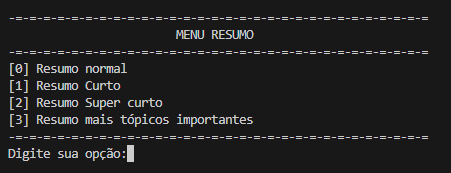

# 📄 Resumidor de PDFs com Gemini

Este projeto é um script em **Python** que permite ler arquivos PDF e gerar resumos automáticos usando a API do **Google Gemini**.  

---


--

--


## 🚀 Funcionalidades
- Ler textos de arquivos PDF.  
- Resumir o conteúdo usando a API do Gemini.  
- Possibilidade de resumir o mesmo texto várias vezes para obter diferentes versões.  
- Menu interativo para carregar novos PDFs e gerar resumos sempre que quiser.  

---

## 🛠️ Tecnologias usadas
- **Python 3**  
- [pdfplumber](https://github.com/jsvine/pdfplumber) – para extrair o texto dos PDFs.  
- [google-generativeai](https://pypi.org/project/google-generativeai/) – para conectar ao Gemini e gerar resumos.  

---

## 📦 Como usar

1. Clone este repositório:
   ```bash
   git clone https://github.com/seu-usuario/resumidor-pdf.git
   cd resumidor-pdf

2. Cole sua chave do gemini dentro do arquivo .env.example:
    ```bash
    CHAVE_API=COLE AQUI SUA CHAVE

3. Renomeio o arquivo .env.example para env:
    ```bash
   cp .env.example .env -> Para Linux/macOS
   copy .env.example .env -> Windows

4. Execute o main.py:
    ```bash
    python main.py